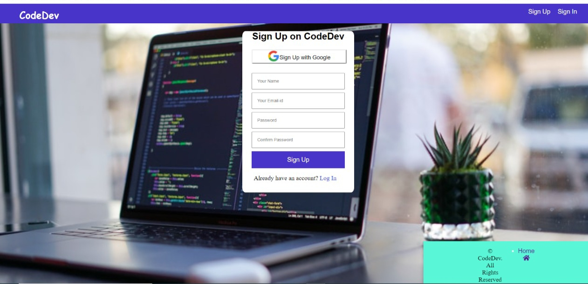
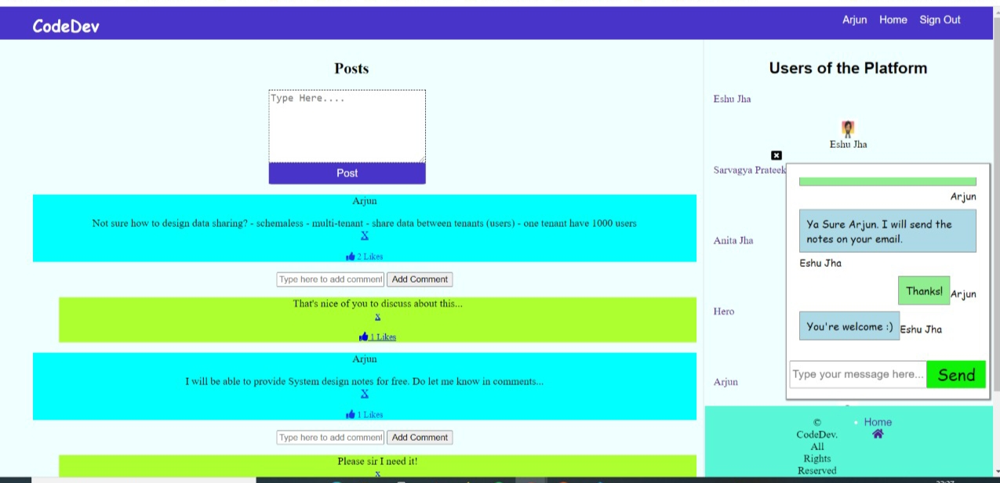
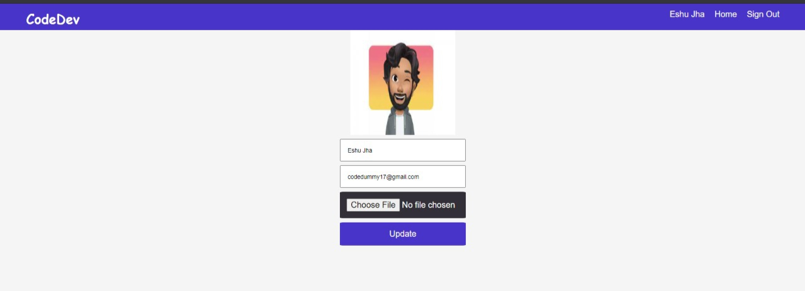

# CodeDev-A Social media Website exclusively for Coders and Developers

## Description of the Web Application---->

It is a social media website for coders and developers wherein they can share their doubts and solutions through posts and comment section of the wesite. They can like posts and comments too so that others can also benefit from it. They can also join a chatroom and start chatting with other developers and coders so that they can get instant solutions to their problems.

## Releavant Screenshots of the project

## Technologies Stack:

### Components
* HTML,CSS,Javascript,jQuery,Ajax
* Node.js,MongoDB,Express.js

### Features used in the project

* passport-google-oauth2 strategy for social authentication through google.
* Nodemailer to send out emails to the user who has published a new comment.
* socket.io for implementing the chat engine facility.
* Kue and Redis for Parallel Jobs for mailers.

